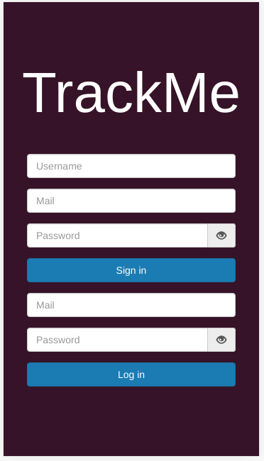
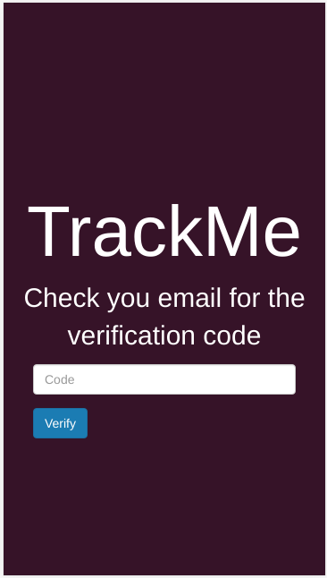
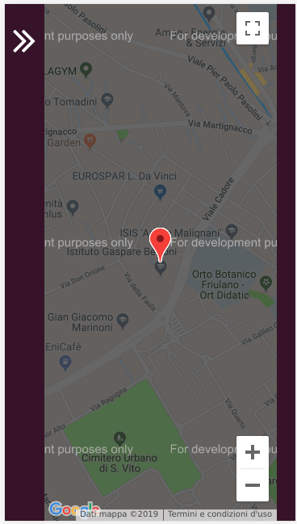
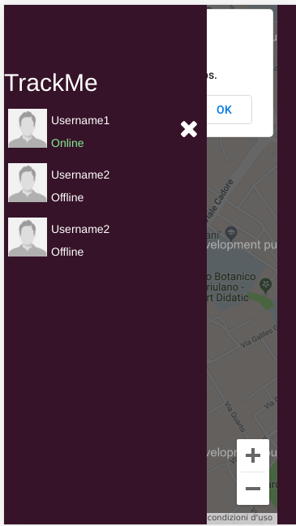
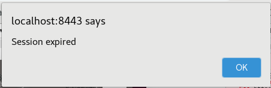

# User Manual

The application is really simple, it is based on 3 main views:

## Login/Signin view

> this first view allows to register yourself or login 

## Check view

> In case of sign-in the user needs also to validate his credentials with a 
second authentication check (a numeric code sent via mail)

## Main view

> Once session token is created, the user can see his friends positions and state,
and the user position is stored every second in the db 

After a while session token will expire and user is redirected to the login page